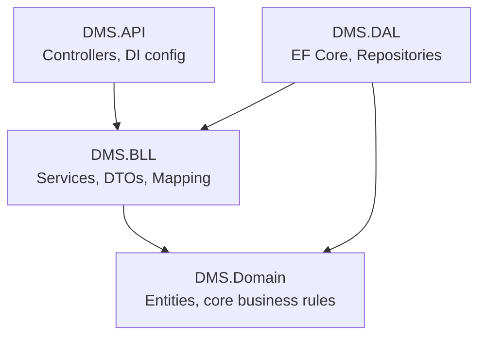

# DMS Project Documentation

## Contributors
 - **at-fhtw** - Abdulah Tepsurkaev (if24b293)
 - **gitmanPrime** - Michael Kovacevic (if23b015)
 - **domaaron** - Aaron Domingo (if24b504)

## Architecture Decisions

### ADR-001: One solution with separate projects
We use one solution for the backend, tests, and future worker applications.
This keeps development organized while allowing separate applications
to run in their own containers.

### ADR-002: Layered architecture
We separate responsibilities into four layers:

- DMS.Domain: Business entities and framework-independent business rules.
- DMS.BLL: Application services, use cases, DTOs, mapping, and repository interfaces.
- DMS.DAL: Database access and repository implementations.
- DMS.API: HTTP controllers, configuration, and dependency registration.

Project references:
- BLL → Domain
- DAL → BLL and Domain
- API → BLL and DAL
- UnitTests → BLL and Domain

Repository interfaces belong in BLL, with implementations in DAL.
This allows business logic to be tested without a production database.

### ADR-003: Technology baseline
We use C# with .NET 10 and ASP.NET Core controllers.
This meets the project requirements.
We use xUnit for unit testing and Visual Studio 2026 for development.

### ADR-004: Document collections as the additional use case
Users can organize documents into named collections.
A document can belong to multiple collections.
We represent membership through a DocumentCollection entity.
Removing a membership does not delete the document.

### ADR-005: Entity property access
Identifiers and creation timestamps have private setters.
Editable metadata has public setters, with validation performed
by BLL services. Entities must not be bound directly to API requests;
the API uses DTOs.

### ADR-006: Document collection membership
DocumentCollection connects documents and collections using their IDs.
The pair (DocumentId, CollectionId) will be the composite primary key,
preventing the same document from appearing twice in one collection.
Membership IDs have private setters and are supplied through a constructor.

### ADR-007: Onion Architecture
We structure the solution following the Onion Architecture pattern. 
Dependencies point strictly inward: outer layers depend on inner layers, 
never the reverse.

- **DMS.Domain** (center): Contains entities and core business rules with no 
  dependencies on any other layer or external framework.
- **DMS.BLL**: Contains application services, use cases, DTOs, mapping profiles, 
  and repository interfaces. Depends only on Domain.
- **DMS.DAL**: Implements the repository interfaces defined in BLL using EF Core. 
  Depends on BLL and Domain, but BLL/Domain have no knowledge of EF Core or 
  PostgreSQL specifics.
- **DMS.API** (outermost): Exposes HTTP endpoints, wires up dependency injection, 
  and translates between HTTP and the application layer.

This keeps the domain and business logic independent of infrastructure concerns 
(database, web framework), making them easier to test and allowing infrastructure 
components (e.g. the file storage backend) to be swapped without touching business 
logic — relevant later in Sprint 4 when local file storage is replaced by MinIO.

### ADR-008: Angular frontend
The frontend is a separate Angular application in `DMS/frontend`.
It uses standalone components, Angular Router, and SCSS.

Components are grouped into feature folders, with shared pages
under `shared`. Route components are loaded lazily.

This provides a common foundation for parallel frontend development.
REST API integration and container deployment will follow.
Whether authentication is required remains to be clarified.

## Progress
- Created the layered solution and unit test project.
- Added project references.
- Removed generated example classes.
- Successfully built the solution.
- Added API health endpoint (GET /health returns "Healthy").
- Sprint 1: implemented domain model, EF Core + Npgsql persistence, repositories,
  business services, REST API with Swagger UI, local file storage and unit tests.
- Sprint 2 preparation: added the Angular frontend scaffold,
  application shell, dashboard placeholder, and fallback page.
  Production build and component tests pass locally.
- Frontend installation, development, build, and testing instructions
  are available in [DMS/frontend/README.md](DMS/frontend/README.md).

## Versioning

We tag the repository after each sprint submission using semantic versioning 
(`vMAJOR.MINOR.0`), e.g. `v0.1.0` for Sprint 1. Tags mark the exact code state 
submitted for grading.

| Tag | Sprint | Description |
|-----|--------|-------------|
| v0.1.0 | Sprint 1 | REST API, EF Core persistence, repository pattern, AutoMapper |

### Technology versions (introduced in Sprint 1)
- .NET 10 SDK 10.0.401, target framework net10.0.
- EF Core 10.0.12 (Microsoft.EntityFrameworkCore + Microsoft.EntityFrameworkCore.Relational).
- Npgsql.EntityFrameworkCore.PostgreSQL 10.0.3.
- Microsoft.EntityFrameworkCore.Design 10.0.12 (API project, for `dotnet ef`).
- Swashbuckle.AspNetCore 10.2.3 (Swagger UI at /swagger).
- Moq 4.20.72 (unit test mocking).
- xUnit 2.9.3 / xunit.runner.visualstudio 3.1.4 / Microsoft.NET.Test.Sdk 17.14.1.

## Testing Strategy
- Use xUnit to test business rules and application services.
- Use repository mocks or test doubles so unit tests do not require PostgreSQL.
- Verify database persistence separately against PostgreSQL.
- Add a full user-story integration test in Sprint 6.
- Achieve greater than 70% code coverage for code reviews.
- Record test commands, results, and coverage scope as tests are implemented.
- Use Vitest for Angular component tests.
- Frontend CI runs dependency installation, production build,
  and tests through GitHub Actions.

## Planned Technologies
These technologies are planned but are not yet integrated:

- RabbitMQ for asynchronous processing.
- MinIO for document storage.
- OCR tooling for extracting document text.
- Elasticsearch for full-text and fuzzy search.
- A GenAI API for generating summaries.

Record exact versions and reasons for technology choices when introduced.